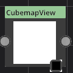
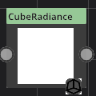

# PhysicalSky

Category : Cubemap
### Description
This is a super node. believe me!
### Parameters
1. ambient
This is a super parameter. believe me!
1. lightdir
This is a super parameter. believe me!
1. Kr
This is a super parameter. believe me!
1. rayleigh brightness
This is a super parameter. believe me!
1. mie brightness
This is a super parameter. believe me!
1. spot brightness
This is a super parameter. believe me!
1. scatter strength
This is a super parameter. believe me!
1. rayleigh strength
This is a super parameter. believe me!
1. mie strength
This is a super parameter. believe me!
1. rayleigh collection power
This is a super parameter. believe me!
1. mie collection power
This is a super parameter. believe me!
1. mie distribution
This is a super parameter. believe me!
1. Size
This is a super parameter. believe me!

# CubemapView

Category : Cubemap
### Description
This is a super node. believe me!
### Parameters
1. view
This is a super parameter. believe me!
1. Mode
This is a super parameter. believe me!
1. LOD
This is a super parameter. believe me!

# EquirectConverter

Category : Cubemap
### Description
This is a super node. believe me!
### Parameters
1. Mode
This is a super parameter. believe me!
1. Size
This is a super parameter. believe me!

# CubeRadiance

Category : Cubemap
### Description
This is a super node. believe me!
### Parameters
1. Mode
This is a super parameter. believe me!
1. Size
This is a super parameter. believe me!
1. Sample Count
This is a super parameter. believe me!

