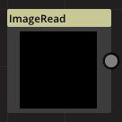
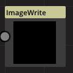
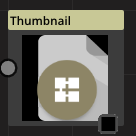
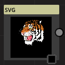
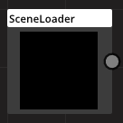
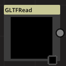

# ImageRead

Category : File
### Description
This is a super node. believe me!
### Parameters
1. File name
This is a super parameter. believe me!
1. +X File name
This is a super parameter. believe me!
1. -X File name
This is a super parameter. believe me!
1. +Y File name
This is a super parameter. believe me!
1. -Y File name
This is a super parameter. believe me!
1. +Z File name
This is a super parameter. believe me!
1. -Z File name
This is a super parameter. believe me!

# ImageWrite

Category : File
### Description
This is a super node. believe me!
### Parameters
1. File name
This is a super parameter. believe me!
1. Format
This is a super parameter. believe me!
1. Quality
This is a super parameter. believe me!
1. Width
This is a super parameter. believe me!
1. Height
This is a super parameter. believe me!
1. Mode
This is a super parameter. believe me!
1. Export
This is a super parameter. believe me!

# Thumbnail

Category : File
### Description
This is a super node. believe me!
### Parameters
1. Make
This is a super parameter. believe me!

# SVG

Category : File
### Description
This is a super node. believe me!
### Parameters
1. File name
This is a super parameter. believe me!
1. DPI
This is a super parameter. believe me!

# SceneLoader

Category : File
### Description
This is a super node. believe me!
### Parameters
1. File name
This is a super parameter. believe me!

# GLTFRead

Category : File
### Description
This is a super node. believe me!
### Parameters
1. File name
This is a super parameter. believe me!
1. Camera
This is a super parameter. believe me!

# ImageRead

Category : File
### Description
This is a super node. believe me!
### Parameters
1. File name
This is a super parameter. believe me!
1. +X File name
This is a super parameter. believe me!
1. -X File name
This is a super parameter. believe me!
1. +Y File name
This is a super parameter. believe me!
1. -Y File name
This is a super parameter. believe me!
1. +Z File name
This is a super parameter. believe me!
1. -Z File name
This is a super parameter. believe me!

# ImageWrite

Category : File
### Description
This is a super node. believe me!
### Parameters
1. File name
This is a super parameter. believe me!
1. Format
This is a super parameter. believe me!
1. Quality
This is a super parameter. believe me!
1. Width
This is a super parameter. believe me!
1. Height
This is a super parameter. believe me!
1. Mode
This is a super parameter. believe me!
1. Export
This is a super parameter. believe me!

# Thumbnail

Category : File
### Description
This is a super node. believe me!
### Parameters
1. Make
This is a super parameter. believe me!

# ImageRead

Category : File
### Description
This is a super node. believe me!
### Parameters
1. File name
This is a super parameter. believe me!
1. +X File name
This is a super parameter. believe me!
1. -X File name
This is a super parameter. believe me!
1. +Y File name
This is a super parameter. believe me!
1. -Y File name
This is a super parameter. believe me!
1. +Z File name
This is a super parameter. believe me!
1. -Z File name
This is a super parameter. believe me!

# ImageWrite

Category : File
### Description
This is a super node. believe me!
### Parameters
1. File name
This is a super parameter. believe me!
1. Format
This is a super parameter. believe me!
1. Quality
This is a super parameter. believe me!
1. Width
This is a super parameter. believe me!
1. Height
This is a super parameter. believe me!
1. Mode
This is a super parameter. believe me!
1. Export
This is a super parameter. believe me!

# Thumbnail

Category : File
### Description
This is a super node. believe me!
### Parameters
1. Make
This is a super parameter. believe me!

# SVG

Category : File
### Description
This is a super node. believe me!
### Parameters
1. File name
This is a super parameter. believe me!
1. DPI
This is a super parameter. believe me!

# SceneLoader

Category : File
### Description
This is a super node. believe me!
### Parameters
1. File name
This is a super parameter. believe me!

# GLTFRead

Category : File
### Description
This is a super node. believe me!
### Parameters
1. File name
This is a super parameter. believe me!
1. Camera
This is a super parameter. believe me!

