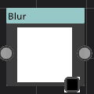
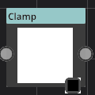

# SmoothStep

Category : Filter
### Description
This is a super node. believe me!
### Parameters
1. Low
This is a super parameter. believe me!
1. High
This is a super parameter. believe me!

# Blur

Category : Filter
### Description
This is a super node. believe me!
### Parameters
1. Type
This is a super parameter. believe me!
1. angle
This is a super parameter. believe me!
1. strength
This is a super parameter. believe me!
1. passCount
This is a super parameter. believe me!

# NormalMap

Category : Filter
### Description
This is a super node. believe me!
### Parameters
1. spread
This is a super parameter. believe me!
1. Invert
This is a super parameter. believe me!

# Invert

Category : Filter
### Description
This is a super node. believe me!
### Parameters
No parameter for this node.

# Ramp

Category : Filter
### Description
This is a super node. believe me!
### Parameters
1. Ramp
This is a super parameter. believe me!

# Clamp

Category : Filter
### Description
This is a super node. believe me!
### Parameters
1. Min
This is a super parameter. believe me!
1. Max
This is a super parameter. believe me!

# AO

Category : Filter
### Description
This is a super node. believe me!
### Parameters
1. strength
This is a super parameter. believe me!
1. area
This is a super parameter. believe me!
1. falloff
This is a super parameter. believe me!
1. radius
This is a super parameter. believe me!

# SmoothStep

Category : Filter
### Description
This is a super node. believe me!
### Parameters
1. Low
This is a super parameter. believe me!
1. High
This is a super parameter. believe me!

# Blur

Category : Filter
### Description
This is a super node. believe me!
### Parameters
1. Type
This is a super parameter. believe me!
1. angle
This is a super parameter. believe me!
1. strength
This is a super parameter. believe me!
1. passCount
This is a super parameter. believe me!

# NormalMap

Category : Filter
### Description
This is a super node. believe me!
### Parameters
1. spread
This is a super parameter. believe me!
1. Invert
This is a super parameter. believe me!

# Invert

Category : Filter
### Description
This is a super node. believe me!
### Parameters
No parameter for this node.

# Ramp

Category : Filter
### Description
This is a super node. believe me!
### Parameters
1. Ramp
This is a super parameter. believe me!

# Clamp

Category : Filter
### Description
This is a super node. believe me!
### Parameters
1. Min
This is a super parameter. believe me!
1. Max
This is a super parameter. believe me!

# AO

Category : Filter
### Description
This is a super node. believe me!
### Parameters
1. strength
This is a super parameter. believe me!
1. area
This is a super parameter. believe me!
1. falloff
This is a super parameter. believe me!
1. radius
This is a super parameter. believe me!

# SmoothStep

Category : Filter
### Description
This is a super node. believe me!
### Parameters
1. Low
This is a super parameter. believe me!
1. High
This is a super parameter. believe me!

# Blur

Category : Filter
### Description
This is a super node. believe me!
### Parameters
1. Type
This is a super parameter. believe me!
1. angle
This is a super parameter. believe me!
1. strength
This is a super parameter. believe me!
1. passCount
This is a super parameter. believe me!

# NormalMap

Category : Filter
### Description
This is a super node. believe me!
### Parameters
1. spread
This is a super parameter. believe me!
1. Invert
This is a super parameter. believe me!

# Invert

Category : Filter
### Description
This is a super node. believe me!
### Parameters
No parameter for this node.

# Ramp

Category : Filter
### Description
This is a super node. believe me!
### Parameters
1. Ramp
This is a super parameter. believe me!

# Clamp

Category : Filter
### Description
This is a super node. believe me!
### Parameters
1. Min
This is a super parameter. believe me!
1. Max
This is a super parameter. believe me!

# AO

Category : Filter
### Description
This is a super node. believe me!
### Parameters
1. strength
This is a super parameter. believe me!
1. area
This is a super parameter. believe me!
1. falloff
This is a super parameter. believe me!
1. radius
This is a super parameter. believe me!

