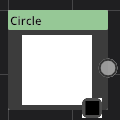
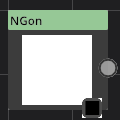

# Circle

Category : Generator
### Description
This is a super node. believe me!
### Parameters
1. Radius
This is a super parameter. believe me!
1. T
This is a super parameter. believe me!

# Square

Category : Generator
### Description
This is a super node. believe me!
### Parameters
1. Width
This is a super parameter. believe me!

# Checker

Category : Generator
### Description
This is a super node. believe me!
### Parameters
No parameter for this node.

# Sine

Category : Generator
### Description
This is a super node. believe me!
### Parameters
1. Frequency
This is a super parameter. believe me!
1. Angle
This is a super parameter. believe me!

# Hexagon

Category : Generator
### Description
This is a super node. believe me!
### Parameters
No parameter for this node.

# CircleSplatter

Category : Generator
### Description
This is a super node. believe me!
### Parameters
1. Distance
This is a super parameter. believe me!
1. Radius
This is a super parameter. believe me!
1. Angle
This is a super parameter. believe me!
1. Count
This is a super parameter. believe me!

# NGon

Category : Generator
### Description
This is a super node. believe me!
### Parameters
1. Sides
This is a super parameter. believe me!
1. Radius
This is a super parameter. believe me!
1. T
This is a super parameter. believe me!

# GradientBuilder

Category : Generator
### Description
This is a super node. believe me!
### Parameters
1. Gradient
This is a super parameter. believe me!

# ReactionDiffusion

Category : Generator
### Description
This is a super node. believe me!
### Parameters
1. boost
This is a super parameter. believe me!
1. divisor
This is a super parameter. believe me!
1. colorStep
This is a super parameter. believe me!
1. passCount
This is a super parameter. believe me!
1. Size
This is a super parameter. believe me!

# Disolve

Category : Generator
### Description
This is a super node. believe me!
### Parameters
1. passCount
This is a super parameter. believe me!
1. Frequency
This is a super parameter. believe me!
1. Strength
This is a super parameter. believe me!
1. Randomization
This is a super parameter. believe me!
1. VerticalShift
This is a super parameter. believe me!

# Circle

Category : Generator
### Description
This is a super node. believe me!
### Parameters
1. Radius
This is a super parameter. believe me!
1. T
This is a super parameter. believe me!

# Square

Category : Generator
### Description
This is a super node. believe me!
### Parameters
1. Width
This is a super parameter. believe me!

# Checker

Category : Generator
### Description
This is a super node. believe me!
### Parameters
No parameter for this node.

# Sine

Category : Generator
### Description
This is a super node. believe me!
### Parameters
1. Frequency
This is a super parameter. believe me!
1. Angle
This is a super parameter. believe me!

# Hexagon

Category : Generator
### Description
This is a super node. believe me!
### Parameters
No parameter for this node.

# CircleSplatter

Category : Generator
### Description
This is a super node. believe me!
### Parameters
1. Distance
This is a super parameter. believe me!
1. Radius
This is a super parameter. believe me!
1. Angle
This is a super parameter. believe me!
1. Count
This is a super parameter. believe me!

# NGon

Category : Generator
### Description
This is a super node. believe me!
### Parameters
1. Sides
This is a super parameter. believe me!
1. Radius
This is a super parameter. believe me!
1. T
This is a super parameter. believe me!

# GradientBuilder

Category : Generator
### Description
This is a super node. believe me!
### Parameters
1. Gradient
This is a super parameter. believe me!

# Circle

Category : Generator
### Description
This is a super node. believe me!
### Parameters
1. Radius
This is a super parameter. believe me!
1. T
This is a super parameter. believe me!

# Square

Category : Generator
### Description
This is a super node. believe me!
### Parameters
1. Width
This is a super parameter. believe me!

# Checker

Category : Generator
### Description
This is a super node. believe me!
### Parameters
No parameter for this node.

# Sine

Category : Generator
### Description
This is a super node. believe me!
### Parameters
1. Frequency
This is a super parameter. believe me!
1. Angle
This is a super parameter. believe me!

# Hexagon

Category : Generator
### Description
This is a super node. believe me!
### Parameters
No parameter for this node.

# CircleSplatter

Category : Generator
### Description
This is a super node. believe me!
### Parameters
1. Distance
This is a super parameter. believe me!
1. Radius
This is a super parameter. believe me!
1. Angle
This is a super parameter. believe me!
1. Count
This is a super parameter. believe me!

# NGon

Category : Generator
### Description
This is a super node. believe me!
### Parameters
1. Sides
This is a super parameter. believe me!
1. Radius
This is a super parameter. believe me!
1. T
This is a super parameter. believe me!

# GradientBuilder

Category : Generator
### Description
This is a super node. believe me!
### Parameters
1. Gradient
This is a super parameter. believe me!

# ReactionDiffusion

Category : Generator
### Description
This is a super node. believe me!
### Parameters
1. boost
This is a super parameter. believe me!
1. divisor
This is a super parameter. believe me!
1. colorStep
This is a super parameter. believe me!
1. passCount
This is a super parameter. believe me!
1. Size
This is a super parameter. believe me!

# Disolve

Category : Generator
### Description
This is a super node. believe me!
### Parameters
1. passCount
This is a super parameter. believe me!
1. Frequency
This is a super parameter. believe me!
1. Strength
This is a super parameter. believe me!
1. Randomization
This is a super parameter. believe me!
1. VerticalShift
This is a super parameter. believe me!

