# Circle

Category : Generator
### Description
This is a super node. believe me!
### Parameters
1. Radius
This is a super parameter. believe me!
1. T
This is a super parameter. believe me!

# Transform
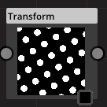

Category : Transform
### Description
This is a super node. believe me!
### Parameters
1. Translate
This is a super parameter. believe me!
1. Scale
This is a super parameter. believe me!
1. Rotation
This is a super parameter. believe me!

# Square
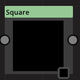

Category : Generator
### Description
This is a super node. believe me!
### Parameters
1. Width
This is a super parameter. believe me!

# Checker
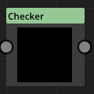

Category : Generator
### Description
This is a super node. believe me!
### Parameters
No parameter for this node.

# Sine
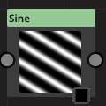

Category : Generator
### Description
This is a super node. believe me!
### Parameters
1. Frequency
This is a super parameter. believe me!
1. Angle
This is a super parameter. believe me!

# SmoothStep
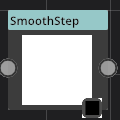

Category : Filter
### Description
This is a super node. believe me!
### Parameters
1. Low
This is a super parameter. believe me!
1. High
This is a super parameter. believe me!

# Pixelize
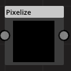

Category : Transform
### Description
This is a super node. believe me!
### Parameters
1. scale
This is a super parameter. believe me!

# Blur
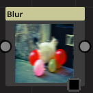

Category : Filter
### Description
This is a super node. believe me!
### Parameters
1. Type
This is a super parameter. believe me!
1. angle
This is a super parameter. believe me!
1. strength
This is a super parameter. believe me!
1. passCount
This is a super parameter. believe me!

# NormalMap
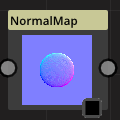

Category : Filter
### Description
This is a super node. believe me!
### Parameters
1. spread
This is a super parameter. believe me!
1. Invert
This is a super parameter. believe me!

# LambertMaterial

Category : Material
### Description
This is a super node. believe me!
### Parameters
1. view
This is a super parameter. believe me!

# MADD
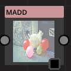

Category : Blend
### Description
This is a super node. believe me!
### Parameters
1. Mul Color
This is a super parameter. believe me!
1. Add Color
This is a super parameter. believe me!

# Hexagon

Category : Generator
### Description
This is a super node. believe me!
### Parameters
No parameter for this node.

# Blend
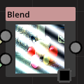

Category : Blend
### Description
This is a super node. believe me!
### Parameters
1. A
This is a super parameter. believe me!
1. B
This is a super parameter. believe me!
1. Operation
This is a super parameter. believe me!

|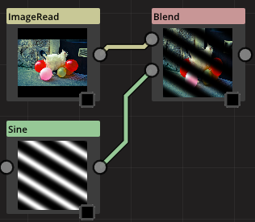|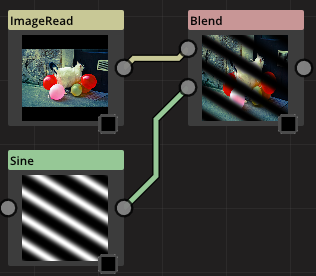|
-|-|-|-
blend enum 0|blend enum 1|blend enum 2|blend enum 3
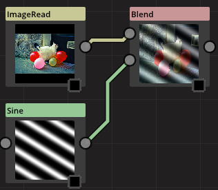||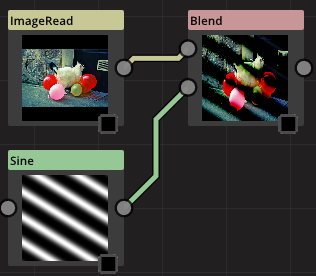|
blend enum 4|blend enum 5|blend enum 6|blend enum 7
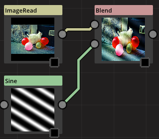|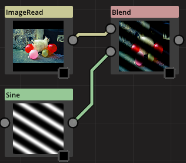|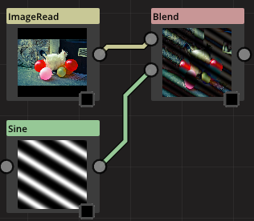|
blend enum 8|blend enum 9|blend enum 10|blend enum 11
|