# Imogen - User documentation

1. [Nodes](#Nodes)
1. [Default Hot Keys](#Default-Hot-Keys)

# Nodes
## Generator
|||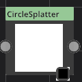||
-|-|-|-|-|-
[Circle](#Circle)|[Checker](#Checker)|[Sine](#Sine)|[CircleSplatter](#CircleSplatter)|[NGon](#NGon)|[GradientBuilder](#GradientBuilder)
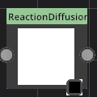|||||
[ReactionDiffusion](#ReactionDiffusion)|[Disolve](#Disolve)||||

## Transform
|||||
-|-|-|-|-|-
[Transform](#Transform)|[Tile](#Tile)|[PolarCoords](#PolarCoords)|[Swirl](#Swirl)|[Crop](#Crop)|[Warp](#Warp)
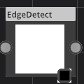|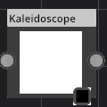|||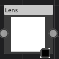|
[EdgeDetect](#EdgeDetect)|[Kaleidoscope](#Kaleidoscope)|[Palette](#Palette)|[ChannelPacker](#ChannelPacker)|[Lens](#Lens)|[Distance](#Distance)

## Filter
|||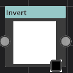||
-|-|-|-|-|-
[SmoothStep](#SmoothStep)|[Blur](#Blur)|[NormalMap](#NormalMap)|[Invert](#Invert)|[Ramp](#Ramp)|[Clamp](#Clamp)
|||||
[AO](#AO)|||||

## Material
|
-|-
[LambertMaterial](#LambertMaterial)|[PBR](#PBR)

## Blend
||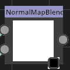
-|-|-
[MADD](#MADD)|[Blend](#Blend)|[NormalMapBlending](#NormalMapBlending)

## None

-
[Color](#Color)

## Noise
||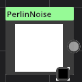
-|-|-
[Voronoi](#Voronoi)|[WorleyNoise](#WorleyNoise)|[PerlinNoise](#PerlinNoise)

## File
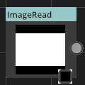||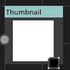|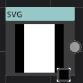|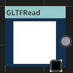
-|-|-|-|-
[ImageRead](#ImageRead)|[ImageWrite](#ImageWrite)|[Thumbnail](#Thumbnail)|[SVG](#SVG)|[GLTFRead](#GLTFRead)

## Paint
|
-|-
[Paint2D](#Paint2D)|[Paint3D](#Paint3D)

## Cubemap
|||
-|-|-|-
[PhysicalSky](#PhysicalSky)|[CubemapView](#CubemapView)|[EquirectConverter](#EquirectConverter)|[CubeRadiance](#CubeRadiance)

## Tools
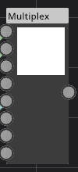
-
[Multiplex](#Multiplex)

## Circle

Category : Generator
### Description
Renders a perfect Circle center in the view port.
### Parameters
1. radius
Clip-space radius.
1. T
Interpolation factor between full white cirle (0.) and height of the hemisphere (1.).

### Example
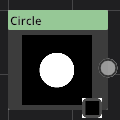

## Transform

Category : Transform
### Description
Transform every source texel using the translation, rotation, scale.
### Parameters
1. translate
2D vector translation.
1. scale
2D vector scale.
1. rotation
Angle in degrees. Center of rotation is the center of the source.

### Example
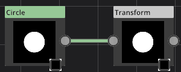

## Checker

Category : Generator
### Description
Renders a 4 square black and white checker. Use a Transform node to scale it to any number of squares.
### Parameters
No parameter for this node.

### Example
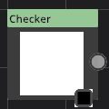

## Sine

Category : Generator
### Description
Renders a one directioned sine as a greyscale value.
### Parameters
1. translation
Translate the sine to adjust its start and end.
1. frequency
Basically, the number of bars.
1. angle
Angle in degrees of the so called bars.

### Example

## SmoothStep

Category : Filter
### Description
Performs a smoothstep operation. Hermite interpolation between 0 and 1 when Low < x < high. This is useful in cases where a threshold function with a smooth transition is desired.
### Parameters
1. low
Lower value for the Hermite interpolation.
1. high
Higher value for the Hermite interpolation. Result is undertimined when high value < low value.

### Example

## Blur

Category : Filter
### Description
Performs a Directional of Box blur filter. Directional blur is a gaussian pass with 16 pixels. Box is 16x16.
### Parameters
1. type
Selection of the Blur type.
1. angle
angle in degrees for the directional blur.
1. strength
Defines how wide the blur pass will be. The bigger, the larger area each pixel will cover.
1. passCount
Multiple passes are supported by this node.

### Example

## NormalMap

Category : Filter
### Description
Computes a normal map using the Red component of the source as the height.
### Parameters
1. spread
The bigger, the stronger the resulting normal will be.
1. invert
Change the direction of the XY components of the normal.

### Example

## LambertMaterial

Category : Material
### Description
simental node.
### Parameters
1. view

### Example

## MADD

Category : Blend
### Description
For each source texel, multiply and and a color value.
### Parameters
1. mulColor
The color to multiply the source with.
1. addColor
The color to add to the source.

### Example

## Blend

Category : Blend
### Description
Blends to source together using a built-in operation. Each source can also be masked and multiplied by a value.
### Parameters
1. A
Color/mask to multiply A source with.
1. B
Color/mask to multiply A source with.
1. operation
Built-ins operation used for blending. Check the examples below.

||
-|-|-
Mode Add|Mode Multiply|Mode Darken
||
Mode Lighten|Mode Average|Mode Screen
||
Mode Color Burn|Mode Color Dodge|Mode Soft Light
||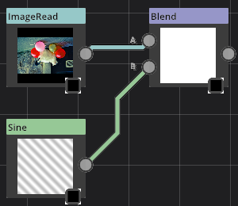
Mode Subtract|Mode Difference|Mode Inverse Difference
||
Mode Exclusion||

## Invert

Category : Filter
### Description
Performs a simple color inversion for each component. Basically, for R source value, outputs 1.0 - R.
### Parameters
No parameter for this node.

### Example

## CircleSplatter

Category : Generator
### Description
Renders a bunch of circle with interpolated position and scales. For N circles the interpolation coefficient will be between [0/N....N/N].
### Parameters
1. distance
First and Last value to interpolate between for the distance to the center of the viewport.
1. radius
First and Last value for the interpolated circle radius.
1. angle
First and Last value for the Angle. The circle position is computed using the angle and the distance.
1. count
The total number of circles to render.

### Example

## Ramp

Category : Filter
### Description
Performs a Ramp on the source components. For each source value (X coord on the ramp graph), retrieve an intensity value (Y on the ramp graph). Optionnaly use an image instead of the editable graph.
### Parameters
1. ramp
Graph that can be edited.

### Example

## Tile

Category : Transform
### Description
Generate a tile map of the source image. With optional overlap. An optional Color input can be used to modulate the tiles color. Color is uniform per tile and picked at its center in the output image.
### Parameters
1. translation
Translate the noise seeds so you can have virtualy infinite different noise.
1. quincunx
Offset line and/or column.
1. noiseFactor
position noise factor. A value of 0 means the grid cells are more tightly packed and with less size variation.
1. rotationFactor
Rotate sprite randomly. This factor limits the rotation amount.
1. scale
How many cells used per dimension.
1. innerScale
Sprite uniform scale.

### Example

## Color

Category : None
### Description
Single plain color.
### Parameters
1. color
Single plain color.

### Example

## NormalMapBlending

Category : Blend
### Description
Blend two normal maps into a single one. Choose the Technique that gives the best result.
### Parameters
1. mode
Different techniques for blending. Check the examples below to see the differences.

### Example

## Voronoi

Category : Noise
### Description
Generate noise based on work by Inigo Quilez.
### Parameters
1. translation
Translate the noise seeds so you can have virtualy infinite different noise.
1. size

1. noise
Interpolate between centered seed (checker) to jittered random position.
1. colorInterpolation
Interpolation factor between full color to distance-like color per cell.
1. distanceBlend
Distance computation type interpolate between Euclydean distance (0.) and Manhattan Distance (1.)

### Example

## WorleyNoise

Category : Noise
### Description
Generate Worley noise with optional Manhattan distance.
### Parameters
1. translation
Translate the noise seeds so you can have virtualy infinite different noise.
1. scale

1. jitter

1. manhattan
Mahattan or linear distance.

### Example
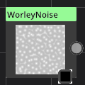

## PerlinNoise

Category : Noise
### Description

### Parameters
1. translation
Translate the noise seeds so you can have virtualy infinite different noise.
1. octaves
The number of noise with different scale for each.
1. lacunarity
Geoemtric scale applied for each octave.
1. gain
Intensity factor applied to each octave.

### Example
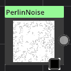

## PBR

Category : Material
### Description
Experimental Node.
### Parameters
1. view

1. displacementFactor

1. geometry

### Example

## PolarCoords

Category : Transform
### Description
Transform the source using polar coordinates.
### Parameters
1. type
Change to direction of the transformation.

### Example
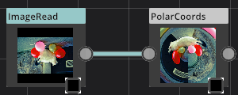

## Clamp

Category : Filter
### Description
Performs a clamp for each component of the source. Basically, sets the min and max of each component.
### Parameters
1. minimum
The minimal value for each source component.
1. maximum
The maximal value for each source component.

### Example
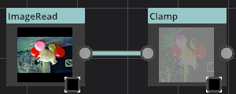

## ImageRead

Category : File
### Description
Imports a file from the disk. Major formats are supported. Cubemaps can be imported using one image for each face of using a cubemap .DDS/.KTX. MP4 movies can be read as well.
### Parameters
1. filename
Single image frame or DDS/KTX cubemap.
1. XPosFilename
Cubemap image face for +X direction.
1. XNegFilename
Cubemap image face for -X direction.
1. YPosFilename
Cubemap image face for +Y direction (Top).
1. YNegFilename
Cubemap image face for -Y direction (Bottom).
1. ZPosFilename
Cubemap image face for +Z direction.
1. ZNegFilename
Cubemap image face for -Z direction.

### Example

## ImageWrite

Category : File
### Description

### Parameters
1. filename

1. format

1. quality

1. width

1. height

1. mode

1. export

### Example

## Thumbnail

Category : File
### Description
Create a thumbnail picture from the source input and applies it to the thumbnail library view.
### Parameters
1. make
Force the evaluation without building the graph.

### Example
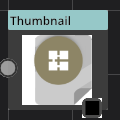

## Paint2D

Category : Paint
### Description
Paint in the parameter viewport using the connected brush. Paint picture is saved in the graph.
### Parameters
1. size
Size of the output in pixels.

### Example

## Swirl

Category : Transform
### Description
Performs a rotation on source based on distance to the viewport center.
### Parameters
1. angles
Rotation for the inner pixels (closer to the center) and the outter pixels. Angles in degrees.

### Example
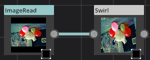

## Crop

Category : Transform
### Description
Set the output as a rectangle in the source.
### Parameters
1. quad
X/Y Position and width/height of the selection rectangle.

### Example
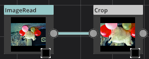

## PhysicalSky

Category : Cubemap
### Description
Generate a physical sky cubemap.
### Parameters
1. ambient
Ambient aka minimal color within the cubemap. Ambient alpha is used to modulate it with the sky.
1. lightdir
Light direction vector.
1. Kr
Kr component value.
1. rayleighBrightness
Rayleigh brightness
1. mieBrightness
Mie brightness factor.
1. spotBrightness
Spot/sun brightness.
1. scatterStrength
Scatter strength.
1. rayleighStrength
Rayleigh strength.
1. mieStrength
Mie strength.
1. rayleighCollectionPower
Rayleigh collection power.
1. mieCollectionPower
Mie collection power.
1. mieDistribution
Mie distribution.
1. size
Size of the cubemap face width in pixels.

### Example
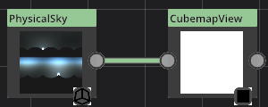

## CubemapView

Category : Cubemap
### Description
Used to display a cubemap using various techniques.
### Parameters
1. view
Used by the Camera technique to rotate the eye direction.
1. mode
Techniques for display. See below for examples.
1. LOD
Use a particular LOD (mipmap) for display. Radiance cube node can help produce cubemap mipmaps.

### Example
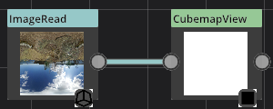

## EquirectConverter

Category : Cubemap
### Description
Converts an equirect source (one single picture containing all environment) into a cubemap output. The inverse (cubemap -> equirect) can also be performed with this node.
### Parameters
1. mode
Select to operation to perform.
1. size
Size fo the ouput in pixels.

### Example

## NGon

Category : Generator
### Description
Compute N plans and color the texels behind every plan accordingly. Texels in front of any plan will be black.
### Parameters
1. sides
Number of uniformly distributed plans.
1. radius
Distance from the plan to the center of the viewport.
1. T
Interpolation factor between full white color and distance to the nearest plan.
1. startAngle
Angle in degrees of the first vertex.

### Example

## GradientBuilder

Category : Generator
### Description
Computes a linear gradient based on key values(position/color).
### Parameters
1. gradient
Double click to add a click. Click and drag a key to move it position. Modify the color for the selected key.

### Example
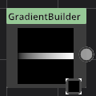

## Warp

Category : Transform
### Description
Displace each source texel using the Warp input.
### Parameters
1. strength
How strong is the displacement. Clip-space value.
1. mode
One of 2 modes. XY offset : R and G channels are used for X and Y displacement. Rotation-Distance: R is used as an angle (0..1 -> 0..2pi) and G is the length of the displacement.

### Example
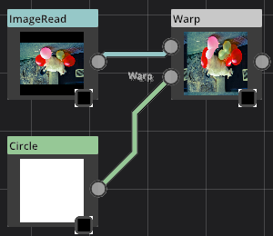

## AO

Category : Filter
### Description
Compute ambient occlusion based on an input heightmap.
### Parameters
1. strength
Strength of the occlusion. The higher value, the stronger dark you'll get.
1. area
Area size used to compute the AO. The higher value, the bigger area.
1. falloff
How much each sample influence the AO.
1. radius
Radius in clipspace used for the computation.

### Example

## SVG

Category : File
### Description
Import an SVG vector graphics image and rasterize it to an image output.
### Parameters
1. filename
Relative or absolute filepath of the SVG file.
1. dpi
Resolution used for rendering the SVG. The higher value, the bigger the image will be.

### Example
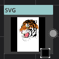

## EdgeDetect

Category : Transform
### Description
Performs an edge detection on the source. Texels that are close in intensity with the neighbours will be white. Black if the difference is strong.
### Parameters
1. radius
The radius size in clipspace used for detection. The higher value, the broader the search is.

### Example

## Kaleidoscope

Category : Transform
### Description
Duplicates portion of the source using rotation and symetry. Basically, computes N plans and duplicate what's in front of the plane to the other with or without symetry.
### Parameters
1. center
Center of the operation in clipspace coordinates [0..1]
1. startAngle
Angle in degrees of the first plan. Total sum of plan angle is 360 deg.
1. splits
How many split plans to use.
1. symetry
Enable symetry for even plans.

### Example
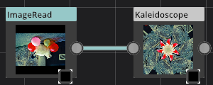

## Palette

Category : Transform
### Description
Find the closest color inside the predefined palette for each texel in the source. Using optional dithering.
### Parameters
1. palette
Predefined palette. Check examples below for results.
1. ditherStrength
Bayer dithering strength (0 = none, 1 = full dither).

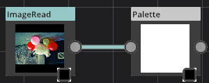|
-|-
Mode CGA0|Mode CGA1
|
Mode CGA2|Mode CGA3
|
Mode CGA4|Mode CGA5
|.png)
Mode EGA|Mode Gameboy(mono)
|
Mode PICO-8|Mode C64

## ReactionDiffusion

Category : Generator
### Description
Use multipass to compute a Reaction Diffusion generative synthesis from a source image. Pass count must be a multiple of 3. First 2 passes are used to blur the image.
### Parameters
1. boost
Component boost
1. divisor
Reaction divisor.
1. colorStep
Component color step.
1. passCount
Multiple passes are supported by this node.
1. size
Size of the output in pixels

### Example

## Disolve

Category : Generator
### Description
Apply a fluid dynamic-like process on the source image. A noise is computed and is used to displace the source.
### Parameters
1. passCount
Multiple passes are supported by this node.
1. frequency
Noise frequency. The higher, the more noise you'll get.
1. strength
Noise strength.
1. randomization
How much randomization is applied.
1. verticalShift
How much in clip-space is moved to the top. Somekind of force applied to texels.

### Example

## GLTFRead

Category : File
### Description
Experimental node.
### Parameters
1. filename

1. camera

### Example
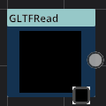

## Paint3D

Category : Paint
### Description
Experimental node.
### Parameters
1. size

1. camera

### Example

## CubeRadiance

Category : Cubemap
### Description
Compute cubemap radiance or irradiance and generate a cubemap with optional mipmaps
### Parameters
1. mode
Radiance or Irradiance.
1. size
Size of the output cubemap face width in pixels.
1. sampleCount
The samples count used for the blur. The more samplem the higher quality.

### Example

## ChannelPacker

Category : Transform
### Description
Pack channels from 1 to 4 inputs into a new output. This can be used to pack normal/roughness/metallic into a 4 channels image.
### Parameters
1. R
The source image and its channel used for Red in the output.
1. G
The source image and its channel used for Green in the output.
1. B
The source image and its channel used for Blue in the output.
1. A
The source image and its channel used for Alpha in the output.

### Example
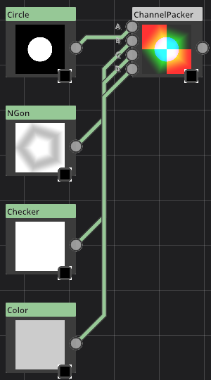

## Lens

Category : Transform
### Description
Deforms the source using a lens computation with an optionnal vignette shading.
### Parameters
1. factor
Lens factor strength.
1. vignette
Vignette shading: Corners get darker. 0 to disable vignette.

### Example

## Distance

Category : Transform
### Description
Generate a signed distance field from a black and white source image.
### Parameters
1. passCount

### Example

## Multiplex

Category : Tools
### Description
Route one input into the output. This choice can be propagated to further nodes.
### Parameters
1. multiplexer
Input selection passed thru the output.

### Example

# Default Hot Keys

Action|Description|Hot key
-|-|-
Layout|Reorder nodes in a simpler layout|Ctrl + L
PlayPause|Play or Stop current animation|F5
AnimationFirstFrame|Set current time to the first frame of animation|V
AnimationNextFrame|Move to the next animation frame|N
AnimationPreviousFrame|Move to previous animation frame|B
MaterialExport|Export current material to a file|Ctrl + E
MaterialImport|Import a material file in the library|Ctrl + I
ToggleLibrary|Show or hide Libaray window|Ctrl + 1
ToggleNodeGraph|Show or hide Node graph window|Ctrl + 2
ToggleLogger|Show or hide Logger window|Ctrl + 3
ToggleSequencer|Show or hide Sequencer window|Ctrl + 4
ToggleParameters|Show or hide Parameters window|Ctrl + 5
MaterialNew|Create a new graph|Ctrl + N
DeleteSelectedNodes|Delete selected nodes in the current graph|Del
AnimationSetKey|Make a new animation key with the current parameters values at the current time|S
HotKeyEditor|Open the Hotkey editor window|Ctrl + K
NewNodePopup|Open the new node menu|Tab
Undo|Undo the last operation|Ctrl + Z
Redo|Redo the last undo|Ctrl + Shift +Z
Copy|Copy the selected nodes|Ctrl + C
Cut|Cut the selected nodes|Ctrl + X
Paste|Paste previously copy/cut nodes|Ctrl + V
BuildMaterial|Build current material|Ctrl + B
CloseLibrary|Close current library|Ctrl + W
MouseState|Show Mouse State as a tooltip|Ctrl + M

