# Imogen - User documentation

1. [Nodes](#Nodes)
1. [Default Hot Keys](#Default-Hot-Keys)

# Nodes
## Generator
|||||
-|-|-|-|-|-
[Circle](#Circle)|[Square](#Square)|[Checker](#Checker)|[Sine](#Sine)|[Hexagon](#Hexagon)|[CircleSplatter](#CircleSplatter)
|||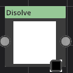||
[NGon](#NGon)|[GradientBuilder](#GradientBuilder)|[ReactionDiffusion](#ReactionDiffusion)|[Disolve](#Disolve)||

## Transform
|||||
-|-|-|-|-|-
[Transform](#Transform)|[Pixelize](#Pixelize)|[Tile](#Tile)|[PolarCoords](#PolarCoords)|[Swirl](#Swirl)|[Crop](#Crop)
|||||
[Warp](#Warp)|[EdgeDetect](#EdgeDetect)|[Kaleidoscope](#Kaleidoscope)|[Palette](#Palette)|[ChannelPacker](#ChannelPacker)|[Lens](#Lens)
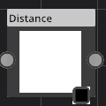|||||
[Distance](#Distance)|||||

## Filter
||||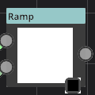|
-|-|-|-|-|-
[SmoothStep](#SmoothStep)|[Blur](#Blur)|[NormalMap](#NormalMap)|[Invert](#Invert)|[Ramp](#Ramp)|[Clamp](#Clamp)
|||||
[AO](#AO)|||||

## Material
||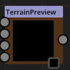||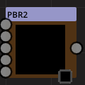
-|-|-|-|-
[LambertMaterial](#LambertMaterial)|[PBR](#PBR)|[TerrainPreview](#TerrainPreview)|[PathTracer](#PathTracer)|[PBR2](#PBR2)

## Blend
||
-|-|-
[MADD](#MADD)|[Blend](#Blend)|[NormalMapBlending](#NormalMapBlending)

## None

-
[Color](#Color)

## Noise
||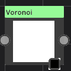
-|-|-
[iqnoise](#iqnoise)|[PerlinNoise](#PerlinNoise)|[Voronoi](#Voronoi)

## File
|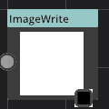||||
-|-|-|-|-|-
[ImageRead](#ImageRead)|[ImageWrite](#ImageWrite)|[Thumbnail](#Thumbnail)|[SVG](#SVG)|[SceneLoader](#SceneLoader)|[GLTFRead](#GLTFRead)

## Paint
|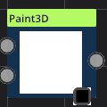
-|-
[Paint2D](#Paint2D)|[Paint3D](#Paint3D)

## Cubemap
|||
-|-|-|-
[PhysicalSky](#PhysicalSky)|[CubemapView](#CubemapView)|[EquirectConverter](#EquirectConverter)|[CubeRadiance](#CubeRadiance)

## Fur
||
-|-|-
[FurGenerator](#FurGenerator)|[FurDisplay](#FurDisplay)|[FurIntegrator](#FurIntegrator)

## Circle

Category : Generator
### Description
This is a super node. believe me!
### Parameters
1. Radius
This is a super parameter. believe me!
1. T
This is a super parameter. believe me!

### Example

## Transform

Category : Transform
### Description
This is a super node. believe me!
### Parameters
1. Translate
This is a super parameter. believe me!
1. Scale
This is a super parameter. believe me!
1. Rotation
This is a super parameter. believe me!

### Example

## Square

Category : Generator
### Description
This is a super node. believe me!
### Parameters
1. Width
This is a super parameter. believe me!

### Example

## Checker

Category : Generator
### Description
This is a super node. believe me!
### Parameters
No parameter for this node.

### Example

## Sine

Category : Generator
### Description
This is a super node. believe me!
### Parameters
1. Frequency
This is a super parameter. believe me!
1. Angle
This is a super parameter. believe me!

### Example
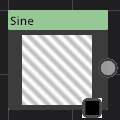

## SmoothStep

Category : Filter
### Description
This is a super node. believe me!
### Parameters
1. Low
This is a super parameter. believe me!
1. High
This is a super parameter. believe me!

### Example
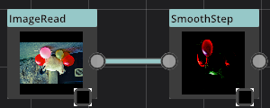

## Pixelize

Category : Transform
### Description
This is a super node. believe me!
### Parameters
1. scale
This is a super parameter. believe me!

### Example
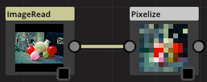

## Blur

Category : Filter
### Description
This is a super node. believe me!
### Parameters
1. Type
This is a super parameter. believe me!
1. angle
This is a super parameter. believe me!
1. strength
This is a super parameter. believe me!
1. passCount
This is a super parameter. believe me!

### Example
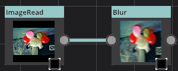

## NormalMap

Category : Filter
### Description
This is a super node. believe me!
### Parameters
1. spread
This is a super parameter. believe me!
1. Invert
This is a super parameter. believe me!

### Example
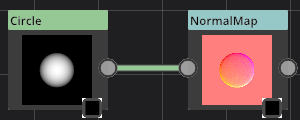

## LambertMaterial

Category : Material
### Description
This is a super node. believe me!
### Parameters
1. view
This is a super parameter. believe me!

### Example
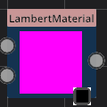

## MADD

Category : Blend
### Description
This is a super node. believe me!
### Parameters
1. Mul Color
This is a super parameter. believe me!
1. Add Color
This is a super parameter. believe me!

### Example
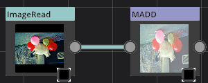

## Hexagon

Category : Generator
### Description
This is a super node. believe me!
### Parameters
No parameter for this node.

### Example

## Blend

Category : Blend
### Description
This is a super node. believe me!
### Parameters
1. A
This is a super parameter. believe me!
1. B
This is a super parameter. believe me!
1. Operation
This is a super parameter. believe me!

-
Mode Add

## Invert

Category : Filter
### Description
This is a super node. believe me!
### Parameters
No parameter for this node.

### Example

## CircleSplatter

Category : Generator
### Description
This is a super node. believe me!
### Parameters
1. Distance
This is a super parameter. believe me!
1. Radius
This is a super parameter. believe me!
1. Angle
This is a super parameter. believe me!
1. Count
This is a super parameter. believe me!

### Example

## Ramp

Category : Filter
### Description
This is a super node. believe me!
### Parameters
1. Ramp
This is a super parameter. believe me!

### Example
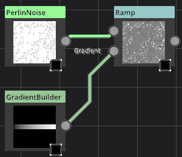

## Tile

Category : Transform
### Description
This is a super node. believe me!
### Parameters
1. Offset 0
This is a super parameter. believe me!
1. Offset 1
This is a super parameter. believe me!
1. Overlap
This is a super parameter. believe me!
1. Scale
This is a super parameter. believe me!

### Example
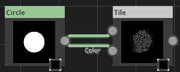

## Color

Category : None
### Description
This is a super node. believe me!
### Parameters
1. Color
This is a super parameter. believe me!

### Example

## NormalMapBlending

Category : Blend
### Description
This is a super node. believe me!
### Parameters
1. Technique
This is a super parameter. believe me!

### Example

## iqnoise

Category : Noise
### Description
This is a super node. believe me!
### Parameters
1. Translation
This is a super parameter. believe me!
1. Size
This is a super parameter. believe me!
1. U
This is a super parameter. believe me!
1. V
This is a super parameter. believe me!

### Example
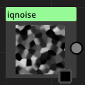

## PerlinNoise

Category : Noise
### Description
This is a super node. believe me!
### Parameters
1. Translation
This is a super parameter. believe me!
1. Octaves
This is a super parameter. believe me!
1. lacunarity
This is a super parameter. believe me!
1. gain
This is a super parameter. believe me!

### Example

## PBR

Category : Material
### Description
This is a super node. believe me!
### Parameters
1. View
This is a super parameter. believe me!
1. Displacement Factor
This is a super parameter. believe me!
1. Geometry
This is a super parameter. believe me!

### Example
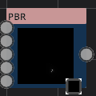

## PolarCoords

Category : Transform
### Description
This is a super node. believe me!
### Parameters
1. Type
This is a super parameter. believe me!

### Example

## Clamp

Category : Filter
### Description
This is a super node. believe me!
### Parameters
1. Min
This is a super parameter. believe me!
1. Max
This is a super parameter. believe me!

### Example

## ImageRead

Category : File
### Description
This is a super node. believe me!
### Parameters
1. File name
This is a super parameter. believe me!
1. +X File name
This is a super parameter. believe me!
1. -X File name
This is a super parameter. believe me!
1. +Y File name
This is a super parameter. believe me!
1. -Y File name
This is a super parameter. believe me!
1. +Z File name
This is a super parameter. believe me!
1. -Z File name
This is a super parameter. believe me!

### Example
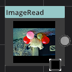

## ImageWrite

Category : File
### Description
This is a super node. believe me!
### Parameters
1. File name
This is a super parameter. believe me!
1. Format
This is a super parameter. believe me!
1. Quality
This is a super parameter. believe me!
1. Width
This is a super parameter. believe me!
1. Height
This is a super parameter. believe me!
1. Mode
This is a super parameter. believe me!
1. Export
This is a super parameter. believe me!

### Example

## Thumbnail

Category : File
### Description
This is a super node. believe me!
### Parameters
1. Make
This is a super parameter. believe me!

### Example

## Paint2D

Category : Paint
### Description
This is a super node. believe me!
### Parameters
1. Size
This is a super parameter. believe me!

### Example
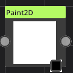

## Swirl

Category : Transform
### Description
This is a super node. believe me!
### Parameters
1. Angles
This is a super parameter. believe me!

### Example

## Crop

Category : Transform
### Description
This is a super node. believe me!
### Parameters
1. Quad
This is a super parameter. believe me!

### Example

## PhysicalSky

Category : Cubemap
### Description
This is a super node. believe me!
### Parameters
1. ambient
This is a super parameter. believe me!
1. lightdir
This is a super parameter. believe me!
1. Kr
This is a super parameter. believe me!
1. rayleigh brightness
This is a super parameter. believe me!
1. mie brightness
This is a super parameter. believe me!
1. spot brightness
This is a super parameter. believe me!
1. scatter strength
This is a super parameter. believe me!
1. rayleigh strength
This is a super parameter. believe me!
1. mie strength
This is a super parameter. believe me!
1. rayleigh collection power
This is a super parameter. believe me!
1. mie collection power
This is a super parameter. believe me!
1. mie distribution
This is a super parameter. believe me!
1. Size
This is a super parameter. believe me!

### Example

## CubemapView

Category : Cubemap
### Description
This is a super node. believe me!
### Parameters
1. view
This is a super parameter. believe me!
1. Mode
This is a super parameter. believe me!
1. LOD
This is a super parameter. believe me!

### Example

## EquirectConverter

Category : Cubemap
### Description
This is a super node. believe me!
### Parameters
1. Mode
This is a super parameter. believe me!
1. Size
This is a super parameter. believe me!

### Example
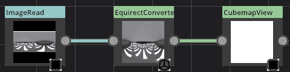

## NGon

Category : Generator
### Description
This is a super node. believe me!
### Parameters
1. Sides
This is a super parameter. believe me!
1. Radius
This is a super parameter. believe me!
1. T
This is a super parameter. believe me!

### Example

## GradientBuilder

Category : Generator
### Description
This is a super node. believe me!
### Parameters
1. Gradient
This is a super parameter. believe me!

### Example

## Warp

Category : Transform
### Description
This is a super node. believe me!
### Parameters
1. Strength
This is a super parameter. believe me!
1. Mode
This is a super parameter. believe me!

### Example

## TerrainPreview

Category : Material
### Description
This is a super node. believe me!
### Parameters
1. Camera
This is a super parameter. believe me!

### Example

## AO

Category : Filter
### Description
This is a super node. believe me!
### Parameters
1. strength
This is a super parameter. believe me!
1. area
This is a super parameter. believe me!
1. falloff
This is a super parameter. believe me!
1. radius
This is a super parameter. believe me!

### Example

## FurGenerator

Category : Fur
### Description
This is a super node. believe me!
### Parameters
1. Hair count
This is a super parameter. believe me!
1. Length factor
This is a super parameter. believe me!

### Example

## FurDisplay

Category : Fur
### Description
This is a super node. believe me!
### Parameters
1. Camera
This is a super parameter. believe me!

### Example
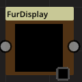

## FurIntegrator

Category : Fur
### Description
This is a super node. believe me!
### Parameters
No parameter for this node.

### Example

## SVG

Category : File
### Description
This is a super node. believe me!
### Parameters
1. File name
This is a super parameter. believe me!
1. DPI
This is a super parameter. believe me!

### Example

## SceneLoader

Category : File
### Description
This is a super node. believe me!
### Parameters
1. File name
This is a super parameter. believe me!

### Example

## PathTracer

Category : Material
### Description
This is a super node. believe me!
### Parameters
1. Mode
This is a super parameter. believe me!
1. Camera
This is a super parameter. believe me!

### Example
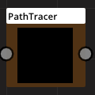

## EdgeDetect

Category : Transform
### Description
This is a super node. believe me!
### Parameters
1. Edges
This is a super parameter. believe me!
1. Radius
This is a super parameter. believe me!

### Example

## Voronoi

Category : Noise
### Description
This is a super node. believe me!
### Parameters
1. Point Count
This is a super parameter. believe me!
1. Seed
This is a super parameter. believe me!
1. Distance Blend
This is a super parameter. believe me!
1. Square Width
This is a super parameter. believe me!

### Example

## Kaleidoscope

Category : Transform
### Description
This is a super node. believe me!
### Parameters
1. Center
This is a super parameter. believe me!
1. Start Angle
This is a super parameter. believe me!
1. Splits
This is a super parameter. believe me!
1. Symetry
This is a super parameter. believe me!

### Example

## Palette

Category : Transform
### Description
This is a super node. believe me!
### Parameters
1. Palette
This is a super parameter. believe me!
1. Dither Strength
This is a super parameter. believe me!

-
Mode CGA0

## ReactionDiffusion

Category : Generator
### Description
This is a super node. believe me!
### Parameters
1. boost
This is a super parameter. believe me!
1. divisor
This is a super parameter. believe me!
1. colorStep
This is a super parameter. believe me!
1. passCount
This is a super parameter. believe me!
1. Size
This is a super parameter. believe me!

### Example
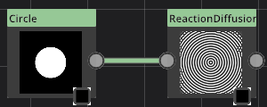

## Disolve

Category : Generator
### Description
This is a super node. believe me!
### Parameters
1. passCount
This is a super parameter. believe me!
1. Frequency
This is a super parameter. believe me!
1. Strength
This is a super parameter. believe me!
1. Randomization
This is a super parameter. believe me!
1. VerticalShift
This is a super parameter. believe me!

### Example
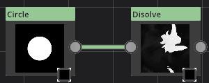

## GLTFRead

Category : File
### Description
This is a super node. believe me!
### Parameters
1. File name
This is a super parameter. believe me!
1. Camera
This is a super parameter. believe me!

### Example

## Paint3D

Category : Paint
### Description
This is a super node. believe me!
### Parameters
1. Size
This is a super parameter. believe me!
1. Camera
This is a super parameter. believe me!

### Example
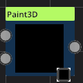

## CubeRadiance

Category : Cubemap
### Description
This is a super node. believe me!
### Parameters
1. Mode
This is a super parameter. believe me!
1. Size
This is a super parameter. believe me!
1. Sample Count
This is a super parameter. believe me!

### Example

## PBR2

Category : Material
### Description
This is a super node. believe me!
### Parameters
1. View
This is a super parameter. believe me!
1. Depth factor
This is a super parameter. believe me!

### Example

## ChannelPacker

Category : Transform
### Description
This is a super node. believe me!
### Parameters
1. R
This is a super parameter. believe me!
1. G
This is a super parameter. believe me!
1. B
This is a super parameter. believe me!
1. A
This is a super parameter. believe me!

### Example

## Lens

Category : Transform
### Description
This is a super node. believe me!
### Parameters
1. Factor
This is a super parameter. believe me!
1. Vignette
This is a super parameter. believe me!

### Example

## Distance

Category : Transform
### Description
This is a super node. believe me!
### Parameters
1. passCount
This is a super parameter. believe me!

### Example
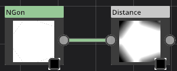

# Default Hot Keys

Action|Description|Hot key
-|-|-
Layout|Reorder nodes in a simpler layout|Ctrl + L
PlayPause|Play or Stop current animation|F5
AnimationFirstFrame|Set current time to the first frame of animation|V
AnimationNextFrame|Move to the next animation frame|N
AnimationPreviousFrame|Move to previous animation frame|B
MaterialExport|Export current material to a file|Ctrl + E
MaterialImport|Import a material file in the library|Ctrl + I
ToggleLibrary|Show or hide Libaray window|Ctrl + 1
ToggleNodeGraph|Show or hide Node graph window|Ctrl + 2
ToggleLogger|Show or hide Logger window|Ctrl + 3
ToggleSequencer|Show or hide Sequencer window|Ctrl + 4
ToggleParameters|Show or hide Parameters window|Ctrl + 5
MaterialNew|Create a new graph|Ctrl + N
ReloadShaders|Reload them|F7
DeleteSelectedNodes|Delete selected nodes in the current graph|Del
AnimationSetKey|Make a new animation key with the current parameters values at the current time|S
HotKeyEditor|Open the Hotkey editor window|Ctrl + K
NewNodePopup|Open the new node menu|Tab
Undo|Undo the last operation|Ctrl + Z
Redo|Redo the last undo|Ctrl + Shift +Z
Copy|Copy the selected nodes|Ctrl + C
Cut|Cut the selected nodes|Ctrl + X
Paste|Paste previously copy/cut nodes|Ctrl + V
BuildMaterial|Build current material|Ctrl + B

