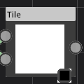
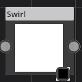
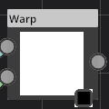
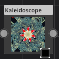
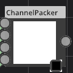

# Transform

Category : Transform
### Description
This is a super node. believe me!
### Parameters
1. Translate
This is a super parameter. believe me!
1. Scale
This is a super parameter. believe me!
1. Rotation
This is a super parameter. believe me!

# Pixelize

Category : Transform
### Description
This is a super node. believe me!
### Parameters
1. scale
This is a super parameter. believe me!

# Tile

Category : Transform
### Description
This is a super node. believe me!
### Parameters
1. Offset 0
This is a super parameter. believe me!
1. Offset 1
This is a super parameter. believe me!
1. Overlap
This is a super parameter. believe me!
1. Scale
This is a super parameter. believe me!

# PolarCoords

Category : Transform
### Description
This is a super node. believe me!
### Parameters
1. Type
This is a super parameter. believe me!

# Swirl

Category : Transform
### Description
This is a super node. believe me!
### Parameters
1. Angles
This is a super parameter. believe me!

# Crop

Category : Transform
### Description
This is a super node. believe me!
### Parameters
1. Quad
This is a super parameter. believe me!

# Warp

Category : Transform
### Description
This is a super node. believe me!
### Parameters
1. Strength
This is a super parameter. believe me!
1. Mode
This is a super parameter. believe me!

# EdgeDetect

Category : Transform
### Description
This is a super node. believe me!
### Parameters
1. Edges
This is a super parameter. believe me!
1. Radius
This is a super parameter. believe me!

# Kaleidoscope

Category : Transform
### Description
This is a super node. believe me!
### Parameters
1. Center
This is a super parameter. believe me!
1. Start Angle
This is a super parameter. believe me!
1. Splits
This is a super parameter. believe me!
1. Symetry
This is a super parameter. believe me!

# Palette

Category : Transform
### Description
This is a super node. believe me!
### Parameters
1. Palette
This is a super parameter. believe me!
1. Dither Strength
This is a super parameter. believe me!

# ChannelPacker

Category : Transform
### Description
This is a super node. believe me!
### Parameters
1. R
This is a super parameter. believe me!
1. G
This is a super parameter. believe me!
1. B
This is a super parameter. believe me!
1. A
This is a super parameter. believe me!

# Transform

Category : Transform
### Description
This is a super node. believe me!
### Parameters
1. Translate
This is a super parameter. believe me!
1. Scale
This is a super parameter. believe me!
1. Rotation
This is a super parameter. believe me!

# Pixelize

Category : Transform
### Description
This is a super node. believe me!
### Parameters
1. scale
This is a super parameter. believe me!

# Tile

Category : Transform
### Description
This is a super node. believe me!
### Parameters
1. Offset 0
This is a super parameter. believe me!
1. Offset 1
This is a super parameter. believe me!
1. Overlap
This is a super parameter. believe me!
1. Scale
This is a super parameter. believe me!

# PolarCoords

Category : Transform
### Description
This is a super node. believe me!
### Parameters
1. Type
This is a super parameter. believe me!

# Swirl

Category : Transform
### Description
This is a super node. believe me!
### Parameters
1. Angles
This is a super parameter. believe me!

# Crop

Category : Transform
### Description
This is a super node. believe me!
### Parameters
1. Quad
This is a super parameter. believe me!

# Warp

Category : Transform
### Description
This is a super node. believe me!
### Parameters
1. Strength
This is a super parameter. believe me!
1. Mode
This is a super parameter. believe me!

# Transform

Category : Transform
### Description
This is a super node. believe me!
### Parameters
1. Translate
This is a super parameter. believe me!
1. Scale
This is a super parameter. believe me!
1. Rotation
This is a super parameter. believe me!

# Pixelize

Category : Transform
### Description
This is a super node. believe me!
### Parameters
1. scale
This is a super parameter. believe me!

# Tile

Category : Transform
### Description
This is a super node. believe me!
### Parameters
1. Offset 0
This is a super parameter. believe me!
1. Offset 1
This is a super parameter. believe me!
1. Overlap
This is a super parameter. believe me!
1. Scale
This is a super parameter. believe me!

# PolarCoords

Category : Transform
### Description
This is a super node. believe me!
### Parameters
1. Type
This is a super parameter. believe me!

# Swirl

Category : Transform
### Description
This is a super node. believe me!
### Parameters
1. Angles
This is a super parameter. believe me!

# Crop

Category : Transform
### Description
This is a super node. believe me!
### Parameters
1. Quad
This is a super parameter. believe me!

# Warp

Category : Transform
### Description
This is a super node. believe me!
### Parameters
1. Strength
This is a super parameter. believe me!
1. Mode
This is a super parameter. believe me!

# EdgeDetect

Category : Transform
### Description
This is a super node. believe me!
### Parameters
1. Edges
This is a super parameter. believe me!
1. Radius
This is a super parameter. believe me!

# Kaleidoscope

Category : Transform
### Description
This is a super node. believe me!
### Parameters
1. Center
This is a super parameter. believe me!
1. Start Angle
This is a super parameter. believe me!
1. Splits
This is a super parameter. believe me!
1. Symetry
This is a super parameter. believe me!

# Palette

Category : Transform
### Description
This is a super node. believe me!
### Parameters
1. Palette
This is a super parameter. believe me!
1. Dither Strength
This is a super parameter. believe me!

# ChannelPacker

Category : Transform
### Description
This is a super node. believe me!
### Parameters
1. R
This is a super parameter. believe me!
1. G
This is a super parameter. believe me!
1. B
This is a super parameter. believe me!
1. A
This is a super parameter. believe me!

